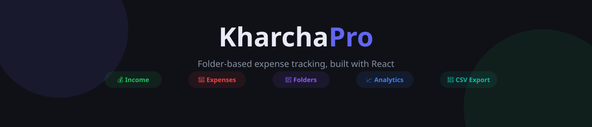
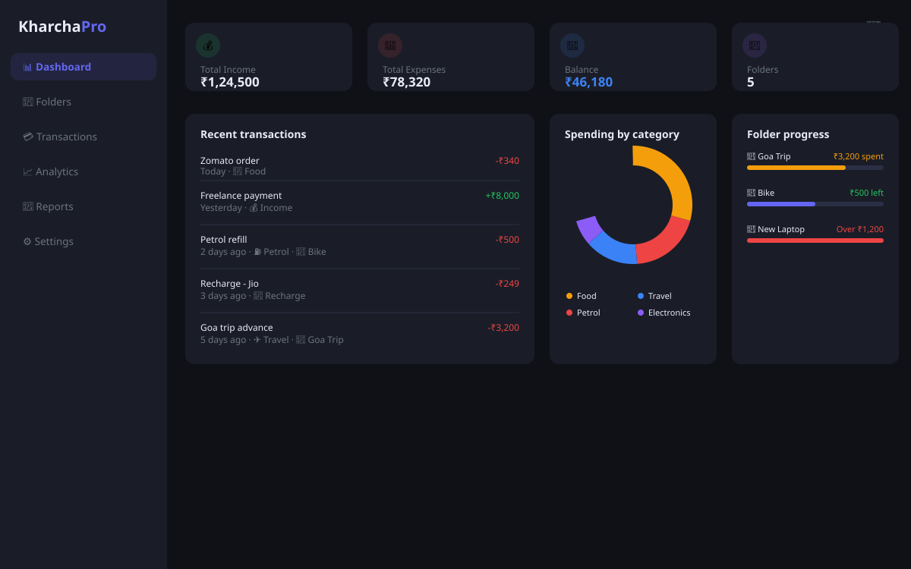
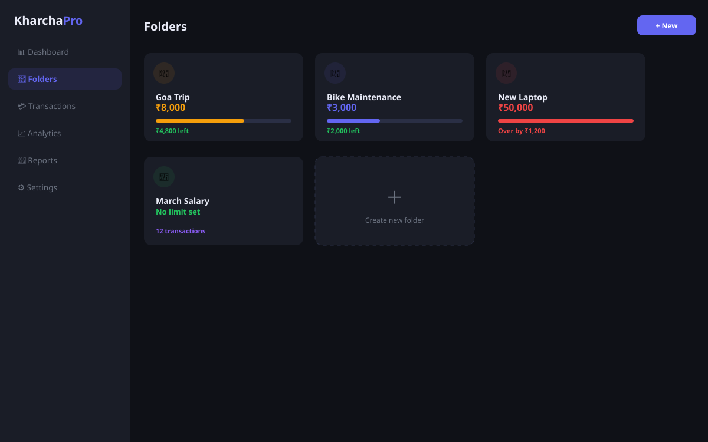
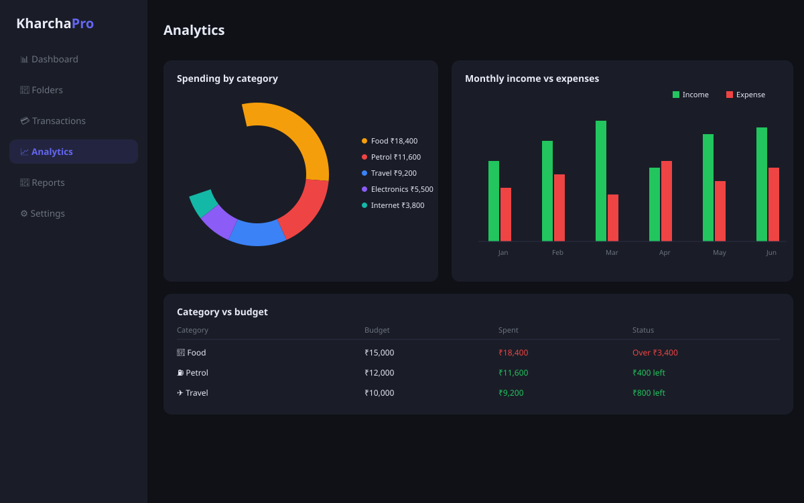

<div align="center">



# 💹 KharchaPro

**A modern, folder-based personal finance tracker — track every rupee with folders, categories, charts, and CSV export.**


[](./LICENSE)


**[🌐 Live Demo](https://arfanpedekar.github.io/kharcha-pro)** · **[📸 Screenshots](#-screenshots)** · **[🚀 Getting Started](#-getting-started)** · **[✨ Features](#-features)**

</div>

---

## 📖 Table of Contents

- [Screenshots](#-screenshots)
- [Features](#-features)
- [Categories](#️-categories)
- [Getting Started](#-getting-started)
- [Tech Stack](#️-tech-stack)
- [Project Structure](#-project-structure)
- [How to Use](#-how-to-use)
- [Contributing](#-contributing)
- [License](#-license)
- [Author](#-author)

---

## 📸 Screenshots

<div align="center">

| Dashboard | Folders |
|:---:|:---:|
|  |  |



**Analytics** — spending breakdown & income vs expense trend

</div>

> These previews are rebuilt from the app's real colors and components (`src/App.jsx`), not live captures. Swap them for real screenshots anytime — run `npm run dev`, capture each view, and drop the images into `/screenshots`.

---

## ✨ Features

<table>
<tr>
<td width="33%" valign="top">

### 📁 Folders
- Title, target amount & note
- Assign transactions to folders
- Used / remaining / over-budget tracking
- Visual progress bar per folder
- Safe delete → moves txns to Unassigned

</td>
<td width="33%" valign="top">

### 💰 Transactions
- Income or Expense entries
- Amount, date, description, category, notes, folder
- Edit & delete anytime
- Filter by type, category, month, folder
- Full-text search

</td>
<td width="33%" valign="top">

### 📊 Dashboard
- Income, expenses, balance, savings rate
- Recent transactions feed
- Spending-by-category donut chart
- Folder progress overview
- Top 5 categories vs budget

</td>
</tr>
<tr>
<td width="33%" valign="top">

### 📈 Analytics
- Pie chart — spend by category
- Bar chart — income vs expense by month
- Category breakdown vs budgets
- Folder summary with status

</td>
<td width="33%" valign="top">

### 📄 Reports
- Monthly financial summary
- Full transaction log
- Category % analysis
- **Export to CSV** (Excel / Sheets ready)

</td>
<td width="33%" valign="top">

### ⚙️ Settings & Alerts
- Monthly budget limits per category
- Dark / light mode toggle
- ⚠️ Low balance warnings
- Over-budget indicators everywhere

</td>
</tr>
</table>

---

## 🗂️ Categories

<div align="center">


</div>

---

## 🚀 Getting Started

### Prerequisites


### Installation

```bash
# Clone the repository
git clone https://github.com/arfanpedekar/kharcha-pro.git
cd kharcha-pro

# Install dependencies
npm install

# Start the development server
npm run dev
```

Open **[http://localhost:5173](http://localhost:5173)** in your browser.

### Build & Deploy

```bash
npm run build     # production build → /dist
npm run deploy    # publish to GitHub Pages
```

---

## 🛠️ Tech Stack

| Technology | Purpose |
|:---|:---|
| ⚛️ **React 18** | UI framework |
| ⚡ **Vite** | Build tool & dev server |
| 📊 **Recharts** | Charts & data visualization |
| 🌐 **GitHub Pages** | Free hosting & deployment |
| 🎨 **CSS-in-JS** | Dynamic theming (dark/light mode) |

---

## 📁 Project Structure

```
kharcha-pro/
├── src/
│   ├── App.jsx          # Main application (all components)
│   └── main.jsx         # React entry point
├── public/
├── screenshots/         # README preview images
├── index.html
├── vite.config.js       # Vite + GitHub Pages config
└── package.json
```

---

## 🧑‍💻 How to Use

| Step | Action |
|:---:|:---|
| 1️⃣ | **Create a folder** — Folders → New Folder. Name it *"March Salary"* or *"Goa Trip"* and set a budget. |
| 2️⃣ | **Add a transaction** — Tap *+ Add Transaction*, fill in amount, category, and assign a folder. |
| 3️⃣ | **Track progress** — Dashboard shows folder bars, charts, and balance at a glance. |
| 4️⃣ | **Set budgets** — Settings → set monthly limits per category. |
| 5️⃣ | **Export** — Reports → Download CSV for Excel or Google Sheets. |

---

## 🤝 Contributing

Contributions are welcome! Feel free to open an issue or submit a pull request.

```bash
git checkout -b feature/your-feature
git commit -m 'Add your feature'
git push origin feature/your-feature
```
Then open a Pull Request 🎉

---

## 📜 License

This project is licensed under the [MIT License](./LICENSE) — free to use, modify, and distribute.

---

## 👤 Author

<div align="center">

**Arfan Pedekar**

[](https://github.com/arfanpedekar)
[](https://linkedin.com/in/arfanpedekar)

Made with ❤️ and ☕

</div>
